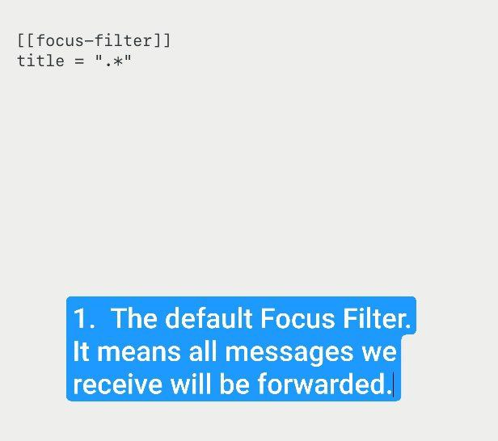
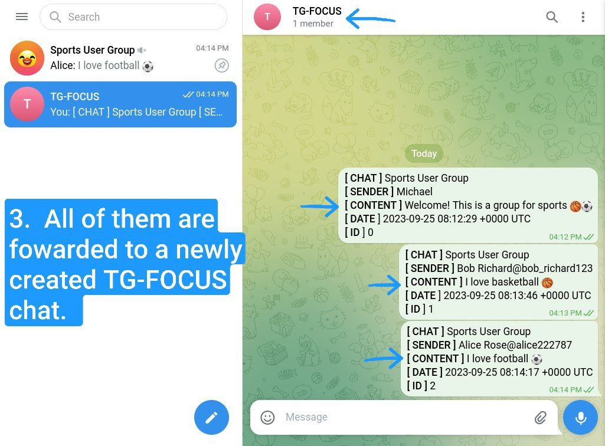
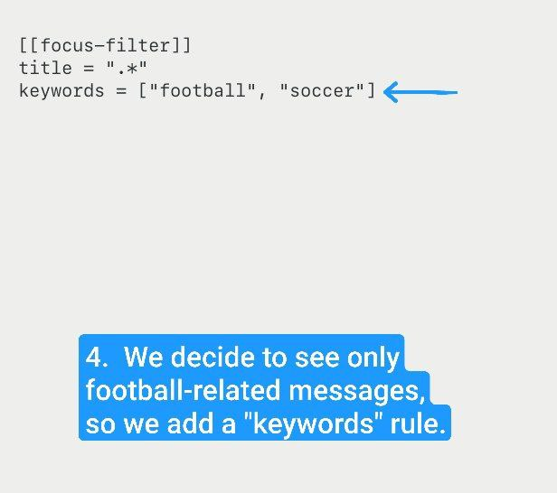
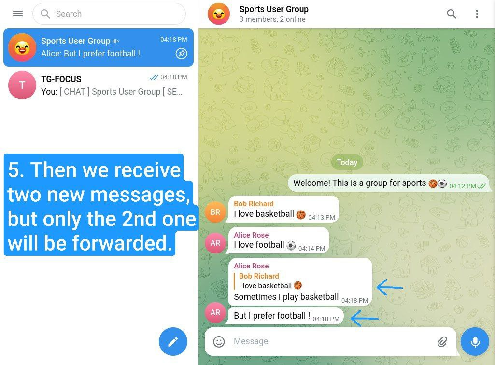
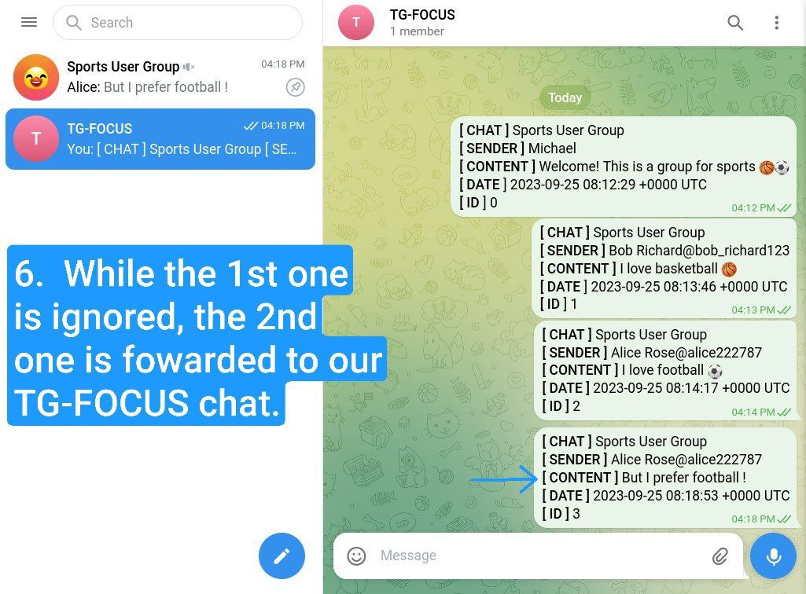
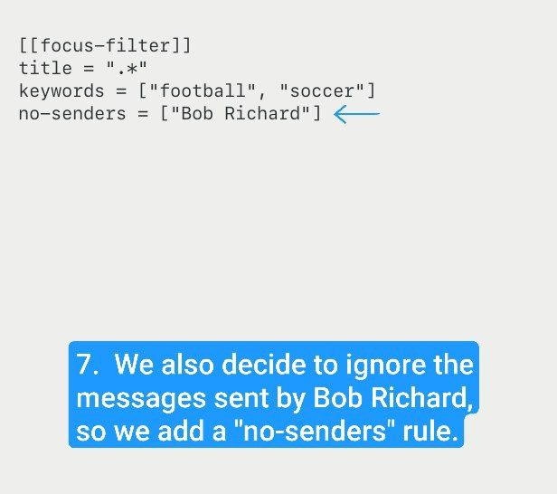
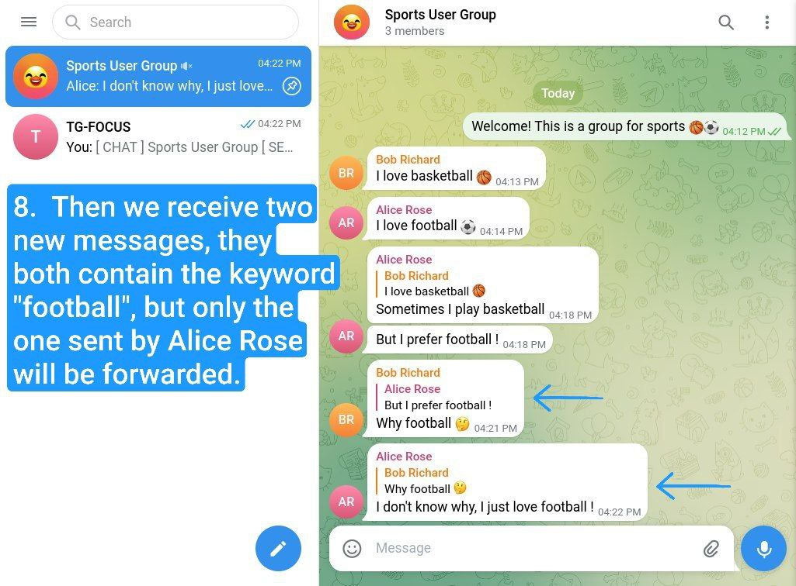

# TG-Focus


# Table of Contents

- [About](#about)
- [A Simple Demo](#a-simple-demo)
- [How To Use](#how-to-use)
  - [Using OCI Image](#using-oci-image)
  - [Using Prebuilt Binaries](#using-prebuilt-binaries)
- [Filtering Rules](#filtering-rules)
  - [Filter Examples](#filter-examples)
- [Q & A](#qa)
  - [Can I trust tg-focus?](#can-i-trust-tg-focus)
- [Development](#development)
  - [Dependencies](#dependencies)
  - [Buidling](#building)
- [Contributing](#contributing)
- [License](#license)
  


# About

tg-focus is a **T**ele**g**ram message filter that helps you
**focus**. It supports several forms of messages, including

1. Text messages
2. Media captions
3. Emoji messages
4. Channel updates

By customizing *Focus Filters*, tg-focus can forward any specific
message from any chat to a dedicated chat *TG-FOCUS*, that way users
have full control of the messages they see.

Telegram is famous for its openness. While users are free to make a
speech in any public chat, they should be equally free to choose what
they see. Telegram's official client apps already have excellent
support for the former feature, tg-focus and other counterparts are
trying to fill the blank in the latter one. 

Notable features:

-   **Reliable & Consistent**: Built on top of native
    C++ interfaces([TDLib](https://core.telegram.org/tdlib/)). All
    communications towards Telegram servers are completely handled by
    TDLib.

-   **Easy to use**: Users can customize *Focus Filter* any
    time they like. The filter accepts both simple text and regular 
    expressions. The configuration file is in human-readable
    [TOML](https://toml.io/en/) format.

-   **Ready to deploy**: Releases are made in three forms: source,
    binary, and OCI image. Users can run it directly on a laptop,
    or use [docker](https://www.docker.com)/[podman](https://podman.io/) to
    deploy it on their servers, without interfering with each other.

# A Simple Demo

Below is a 9-step demonstration of common use cases for tg-focus. 






[Back to start](#a-simple-demo)



[Back to start](#a-simple-demo)



[Back to start](#a-simple-demo)



[Back to start](#a-simple-demo)



[Back to start](#a-simple-demo)



[Back to start](#a-simple-demo)


[Back to start](#a-simple-demo)


# How To Use

Before anything make sure you have:

1. A Telegram account
2. Telegram API ID and corresponding API HASH, they can be obtained 
   at https://my.telegram.org. 

Suppose you're:

## Using OCI Image

Make sure have docker or podman installed on your system already: 

1. Pull the image and run:

```sh
docker pull docker.io/micl2e2/tg-focus:latest
docker run -d docker.io/micl2e2/tg-focus
```

2. Login your telegram account first, here you should provide API ID,
API HASH, and your phone number:

```sh
docker exec -it <container-name> tf-conf auth
```

3. If logined successfullly, a new chat named *TG-FOCUS* will be
   created, the subsequent messages will be filtered and forwarded to
   this chat.

4. Change the *Focus Filter*s any time you like, to make adjustment on
   the messages you'd like to receive on that chat.

```sh
docker exec -it <container-name> tf-conf filters
```

5. Done


## Using Prebuilt Binaries

1. Download the binaries.

2. Login your Telegram account first, it needs API ID, API HASH, and your
phone number, the first two can be obtained in https://my.telegram.org:

```sh
/path/to/tf-conf auth
```

3. Launch tg-focus daemon:

```sh
/path/to/tf-focusd
```

4. If logined successfullly, a new chat named `TG-FOCUS` will be
   created, the subsequent messages will be filtered and forwarded to
   this chat.

5. Change the *Focus Filter*s any time you like, to make adjustment on
   the messages you would like to see on that chat.

```sh
/path/to/tf-conf filters
```

6. Done


# Filtering Rules

A *Focus Filter* is a filter used by tg-focus to match against the
message's text content(text, emoji, or media caption). Users can add
as many filters as they like, when a message comes, they are tried one
by one, if there is any filter than can *match* the message and not
*reject* the message , it will be forwarded.

Currently *Focus Filter* can *match*:

1. Chat title
2. Keywords
3. Senders

can *reject*:

1. Keywords
2. Senders

A message is forwarded if and only if:

- the message is matched by a *Focus Filter*, **and**
- the message is not rejected by that *Focus Filter*.

(Note that the first three rules can be regarded as **whitelist** ,
the second two rules can be regarded as **blacklist**) 


## Filter Examples

Say we want to forward all messages in a chat named
"👍AnAwesomeChat👍": 

works, the chat title is fully matched: 

```toml
[[focus-filter]]
title = "👍AnAwesomeChat👍"
```

works, the chat title is partly matched:

```toml
[[focus-filter]]
title = "AnAwesomeChat"
```

works, the chat title is partly matched: 

```toml
[[focus-filter]]
title = "Awesome"
```

works, the chat title is partly matched:

```toml
[[focus-filter]]
title = "👍"
```

works, the regular expression matches the chat title:

```toml
[[focus-filter]]
title = ".*Awesome.*"
```

Say we want to forward the messages that contain "football", but not
"basketball", from a chat named "Sports User Group". We can write our filters as

```toml
[[focus-filter]]
title = "Sports User Group"
keywords = ["football", "soccer"]
no-keywords = ["basketball"]
```

Say we want the messages containing "football", or any other
messages except the ones containing "basketball", and the ones sent by
the user whose full name is "Basketball Lover", or the ones sent by the
user whose user ID is "alice_love_basketball", from a chat named
"SportsUserGroup". We can write the filter as:

```toml
# 1st
[[focus-filter]]
title = "Sports User Group"
keywords = ["football", "soccer"]

# 2nd
[[focus-filter]]
title = "Sports User Group"
no-keywords = ["basketball"]
no-senders = ["Basketball Love", "@alice_love_basketball"]
```

So these message will be forwarded:

- `Alice: I love football!` (matching the 1st)
- `Bob: I play soccer.` (matching the 1st)
- `Alice: I am good at swimming.` (matching the 2nd)
- `Bob: Sometime I also play badminton.` (matching the 2nd)
- `Alice: I play football and basketball.` (matching the 1st, skip the 2nd)

these will NOT be forwarded:

- `Alice: I play badminton and basketball.` (matching the 2nd's
  "no-keywords" means a *reject*)
- `Basketball Lover: Hellop everyone!` (a *reject* by the 2nd)
- `Alice @alice_love_basketball: Hi, I am Alice, I love sports.`
  (a *reject* by the 2nd)


# Q&A

## Can I trust tg-focus?

Absolutely yes!

First of all, consider that tg-focus is a GPL-licensed [free
software](https://www.gnu.org/philosophy/free-sw.en.html). 

tg-focus inherits the openness from TDLib, its source as well as its 
dependencies' source are completely open. Additionally, all its
binaries and OCI images will **not** be built by any individual, but
by Github-hosted containers. Build details such as checksums are
shipped along with binaries and images. Users are free to verify them
on the GitHub Action
[page](https://github.com/micl2e2/tg-focus/actions). 

Telegram bot is useful for some specific tasks, but not sufficient
to be a **comprehensive** message filter. Therefore, during the
authorization process, tg-focus needs to log in user's account,
which in turn needs a phone number and login code,
just as any functional Telegram client would require. It only saves
API ID/HASH on the user's machine because these two are
required each time TDLib initializes. But **under no
circumstances** would tg-focus save the user's phone number or login
code, even on your local machine.

# Development

## Dependencies

- CMake
- C++20 compatible compiler
- TDLib (meaning the dependencies of TDLib)

## Building

```sh
# Get the source
git clone --depth=1 https://github.com/micl2e2/tg-focus

# Setup a release build
cmake -DCMAKE_BUILD_TYPE=Release -B build

# Build
cmake --build build

# Test
cd build && ctest
```

# Contributing

tg-focus is still far from perfect, any form of contribution is
welcomed! 

This is not an exhaustive list:

- Ask question (open an issue with label [](https://github.com/micl2e2/tg-focus/issues/new))
- Bug Report (open an issue with label [](https://github.com/micl2e2/tg-focus/issues/new))
- Feature Request (open an issue with label
  [](https://github.com/micl2e2/tg-focus/issues/new))
- Documentation Improvement
- Code Contribution (tg-focus follows [GNU](https://www.gnu.org/prep/standards/standards.html) code style)


# License

tg-focus is licensed under [GNU General Public License Version
3.0](https://github.com/micl2e2/tg-focus/blob/master/LICENSE-GPL). 

