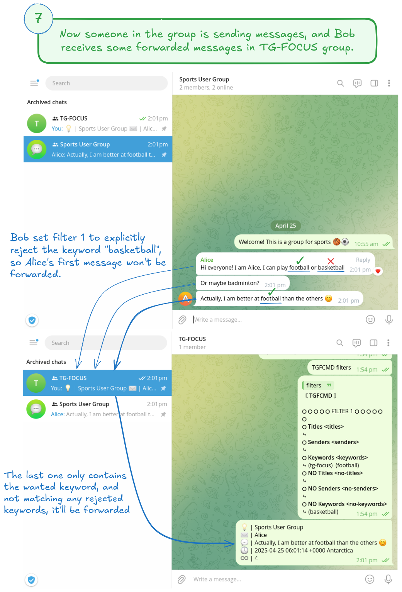

# Table of Contents

-   [TG-Focus💡](#org9051890)
-   [Quickstart](#org2ec0c7f)
-   [TGFCMD Examples](#orgbececa8)
-   [Filters Rules](#orgd35a85d)
-   [Contributing](#org2485130)
-   [FAQ](#orge741ceb)
-   [License](#orga266580)

# TG-Focus💡

<a href="<https://github.com/micl2e2/tg-focus/blob/master/LICENSE-GPL>"></a>
<a href="<https://core.telegram.org/tdlib>"></a>
<a href="<https://github.com/tdlib/td>"></a>

tg-focus is a reliable <b>T</b>ele<b>g</b>ram message filter/forwarder that helps
you **focus**. A gentle user bot for message forwarding. Most of message
types are supported: public/private chats, channel updates, and more.

With [TGFCMD](#usingtgfcmd), you have full control of the messages you'd see in a dedicated chat **TG-FOCUS**.

Being built on top of [TDLib](https://core.telegram.org/tdlib/) directly, tg-focus is inherently as
consistent, reliable and stable as TDLib itself for most
Telegram-specific features. 

The supported platforms are:

<table border="2" cellspacing="0" cellpadding="6" rules="groups" frame="hsides">

<colgroup>
<col  class="org-left" />

<col  class="org-left" />

<col  class="org-left" />
</colgroup>
<thead>
<tr>
<th scope="col" class="org-left">OS \ ARCH</th>
<th scope="col" class="org-left">x86 64</th>
<th scope="col" class="org-left">aarch64</th>
</tr>
</thead>

<tbody>
<tr>
<td class="org-left">Linux</td>
<td class="org-left">✅</td>
<td class="org-left">✅</td>
</tr>

<tr>
<td class="org-left">Windows <a href="https://learn.microsoft.com/en-us/windows/wsl/install">WSL</a></td>
<td class="org-left">✅</td>
<td class="org-left">✅</td>
</tr>

<tr>
<td class="org-left">macOS <a href="https://github.com/apple/container?tab=readme-ov-file#get-started">Containerization</a></td>
<td class="org-left">🔨</td>
<td class="org-left">🔨</td>
</tr>

<tr>
<td class="org-left">Windows</td>
<td class="org-left">🔨</td>
<td class="org-left">🔨</td>
</tr>

<tr>
<td class="org-left">BSD</td>
<td class="org-left">🔨</td>
<td class="org-left">🔨</td>
</tr>

<tr>
<td class="org-left">macOS</td>
<td class="org-left">🔨</td>
<td class="org-left">🔨</td>
</tr>

<tr>
<td class="org-left">&#xa0;</td>
<td class="org-left">&#xa0;</td>
<td class="org-left">&#xa0;</td>
</tr>
</tbody>
</table>

Supported(✅). Work In Progress(🔨). 

## Overhead

In case someone cares about the overhead, here is a rough overview: After **~2 months** of running
on a **1C 1G** machine, with **~500K** messages being filtered, it would
occupy **<1%** of CPU and **<40%** of memory (TDLib included). 

# Quickstart

You can use [Docker](#usingdocker) or [executable binaries](#usingbinaries) to get started.

## Using Docker/Podman

The following 5 steps will help you run tg-focus and filter some
specific messages.

1.  Download the images:
    
        docker pull micl2e2/tg-focus
    
    or
    
        # if you use Podman rather than Docker
        podman pull docker.io/micl2e2/tg-focus
        
        # If you have trouble in reaching Docker Hub, try GitHub Package:
        docker pull ghcr.io/micl2e2/tg-focus
        # or
        podman pull ghcr.io/micl2e2/tg-focus

2.  Run tg-focus:
    
        docker run -d --name tgfocus micl2e2/tg-focus

3.  Log in your Telegram account:
    
        docker exec -i tgfocus auth
        
        # Enter phone number: +1 23 4567
        # Enter login code: xxxxxx
    
    *note: phone number in international format `+1 23 4567` if your
    number is `23 4567` with region code `+1` (spaces are allowed).*
    
    If everthing works fine, you should see:
    
    > Logged in!
    
    You can check more details about tg-focus by `docker exec -i tgfocus status`.

4.  Go back to your Telgram application, wait for the TG-FOCUS
    group showing up. *(usually takes up 1~2 mins, depends on your
    network connection)* 
    
    > If TG-FOCUS group doesn't appear, send a message "tg-focus" in a
    > random group(e.g. Saved Messages). *This is because by default, only
    > messages contain "tg-focus" will be filtered and forwarded.*
    
    > If TG-FOCUS group doesn't appear after a long wait(e.g. 10 mins),
    > run a command `./tgfocus status`, report and open a GitHub issue
    > with the command output attached.

5.  Once the group shown up, you send a message `TGFCMD help` to get
    started. Check [TGFCMD](#usingtgfcmd) for more details.

## Using Binaries

The following 6 steps will help you start up tg-focus and filter some
specific messages.

1.  Download the binaries at GitHub releases [page](https://github.com/micl2e2/tg-focus/releases).

2.  Extract the files:
    
        # linux 
        tar xf tg-focus-3.0-linux-x86_64.tar.gz
        cd tg-focus-3.0-linux-x86_64

3.  Log in your Telegram account:
    
        ./tgfocus auth
        
        # Enter phone number: +1 23 4567
        # Enter login code: xxxxxx
    
    *note: phone number in international format `+1 23 4567` if your
    number is `23 4567` with region code `+1` (spaces are allowed).*
    
    If everthing works fine, you should see:
    
    > Logged in!

4.  Start up tg-focus daemon:
    
        ./tgfocus quickstart
    
    *note: conversely, use `./tgfocus shutdown` to shutdown tg-focus*
    
    If everthing works fine, you should see:
    
    > startup: done
    > 
    > focus-start: done

5.  Go back to your Telgram application, wait for the TG-FOCUS
    group showing up. *(usually takes up 1~2 mins, depends on your
    network connection)* 
    
    > If TG-FOCUS group doesn't appear, send a message "tg-focus" in a
    > random group(e.g. Saved Messages). *This is because by default, only
    > messages contain "tg-focus" will be filtered and forwarded.*
    
    > If TG-FOCUS group doesn't appear after a long wait(e.g. 10 mins),
    > run a command `./tgfocus status`, report and open a GitHub issue
    > with the command output attached.

6.  Once the group shown up, you send a message `TGFCMD help` to get
    started. Check [TGFCMD](#usingtgfcmd) for more details.

## Using TGFCMD

Say there is a Telegram user, called Bob. He owns
a group. Every day, plenty of messages are sending out in that
group, it is too overwhelming, Bob wants to focus on the
messages that strongly interest him, he decides to use
tg-focus. After the previous 6-step setup, he now is going to use
TGFCMD to configure his tg-focus to forward the messages he is
strongly interested in:

 
 
 
 
 
 
 

# TGFCMD Examples

*Note that TGFCMD commands are to be sent out in the TG-FOCUS group*

To forward the messages that belong to the chat "Freedom User Group":

    TGFCMD filter.edit 1 titles add "Freedom User Group"

To forward the messages that sent by the user "Some One":

    TGFCMD filter.edit 1 senders add "Some One"

To forward the messages that contain a word "freedom":

    TGFCMD filter.edit 1 keywords add "freedom"  

To forward two types of messages, the first contains a word "free
things" and belongs to the chat "Nonfree Lovers", the second contains
a word "nonfree things" and belongs to "Free Lovers":

    TGFCMD filter.edit 1 titles add "Nonfree Lovers"
    TGFCMD filter.edit 1 keywords add "free things"
    TGFCMD filter.edit 2 titles add "Free Lovers"
    TGFCMD filter.edit 2 keywords add "nonfree things"

Not to forward the messages that sent by the user "Nonfree Lover":

    TGFCMD filter.edit 1 no-senders add "Nonfree Lover"

Check current filters configuration:

    TGFCMD filters

Pause forwarding:

    TGFCMD pause

Resume forwarding:

    TGFCMD resume

# Filters Rules

Filters configurationa is composed of many *Focus Filters*. A *Focus
Filter* is a filter to match against the message's 
chat/sender/content. They have several rules(or properties):

-   *titles*
-   *keywords*
-   *senders*
-   *no-titles*
-   *no-senders*
-   *no-keywords*

Simply put, *titles*, *keywords*, *senders* are the lists of
chat titles, keywords, senders that you are interested in respectively.
*no-titles*, *no-keywords*, *no-senders* are the ones you don't want
to see.

Users can add values to those rules as many as they like, they
accept ****simple text**** or ****regular expression****, as well as filters.

When a message comes, filters are tried one by one, if there is any
filter than can **match** the message and not **reject** it, it
will be forwarded to TG-FOCUS chat. 

A focus filter **matches** the message if it matches any filter's:

-   *titles* and
-   *senders* and
-   *keywords*

Note that an empty rule(i.e., you haven't configure it) matches
everthing.

If a focus filter  fails to match the incoming message, the next focus
filter will be tried. If all focus filters fail to match it, the
message will be discarded.

A focus filter **rejects** the message if it matches any filter's:

-   *no-title* or
-   *no senders* or
-   *no-keywords*

Note thta if any focus filter rejects the message, the next focus
filter will not be tried, and the message will be discarded.

(You can think of the first three rules as *whitelist*,
the last three rules as *blacklist*)

# Contributing

tg-focus is still far from perfect, any form of contribution is
welcomed:

-   Ask question (open an issue with label "question")
-   Bug Report (open an issue with label "bug")
-   Feature Request (open an issue with label "enhancement")
-   Documentation Improvement
-   Code Contribution (tg-focus follows [GCC](<https://gcc.gnu.org/>) code
    style)

## ToDo list

This is a list of TODOs that are certainly to be finished in the near
future, you can pick one then get started if you are interested in:

-   [ ] Project Logo (also used as TG-FOCUS group avatar)
-   [ ] Forwarded message's Look
-   [ ] Configuration in JSON Format
-   [ ] Windows Port
-   [ ] BSD Port
-   [ ] macOS Port
-   [ ] More C++20/23/26 features
-   [ ] More different build systems

## Development

### Linux

Distribution:

-   Debian 11 (Bullseye)
    -   *note: bullseye-like distros might work, but it won't be
        considered an issue if not working there.*

Software:

-   bash, git, sudo, apt, etc.
    -   run `bash ci/prep-libs-deb11-x86_64.bash` to automatically
        prepare them.
-   custom built GCC
    -   run `bash ci/prep-toolc-deb11-x86_64.bash` to automatically
        prepare them.

Building:

-   run `bash ci/build-tgfocus-deb11-x86_64.bash` to get a Release
    build.
-   run `DDD=1 bash ci/build-tgfocus-deb11-x86_64.bash` to get a Debug
    build.

# FAQ

## Why yet another Telegram message forwarder?

There are already many TG message forwarders over there, and some of
them have been continuously developed for a long time. I do think most
of them are doing a great job. However what I was looking for was a
message forwarder with a combination of stability, reliability,
transparency, and flexibility, none of them could completely meet my
personal preference, at least in the days before this project
started.

## Can I trust tg-focus?

Yes.

First of all, consider that tg-focus is a GPL-licensed [free
software](<https://www.gnu.org/philosophy/free-sw.en.html>). As for
privacy, only credentials necessary for tdlib initialization are saved
on the user's machine. And they are completely *yours-irrelavent*. As
for source code, tg-focus's source as well as its dependencies' source
are completely open.

And one more step we take is that, all of released binaries are built
by **not** any individual, but **Github-hosted** machines.
Check [github actions](https://github.com/micl2e2/tg-focus/actions) for more details.

# License

tg-focus is licensed under *GNU General Public License Version
3.0*. There is NO WARRANTY, to the extent permitted by law.

