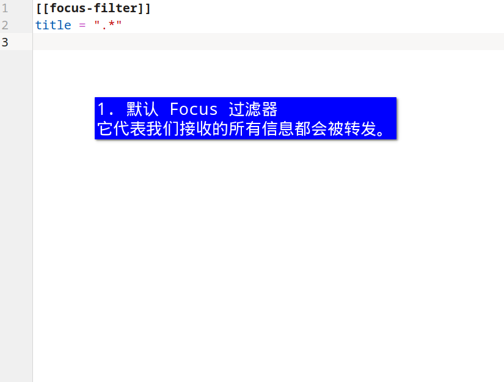
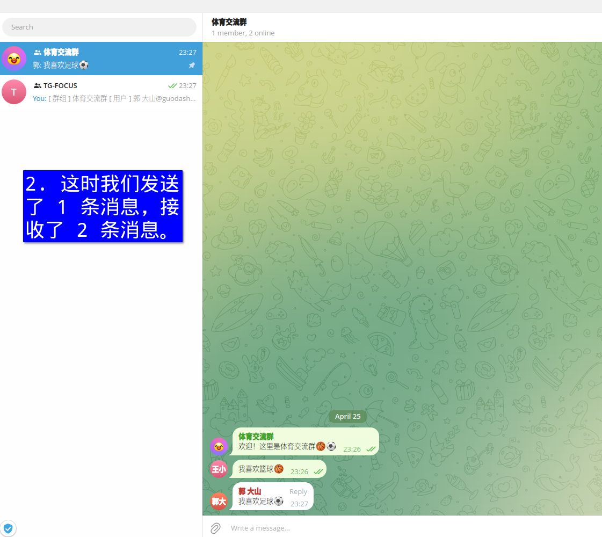
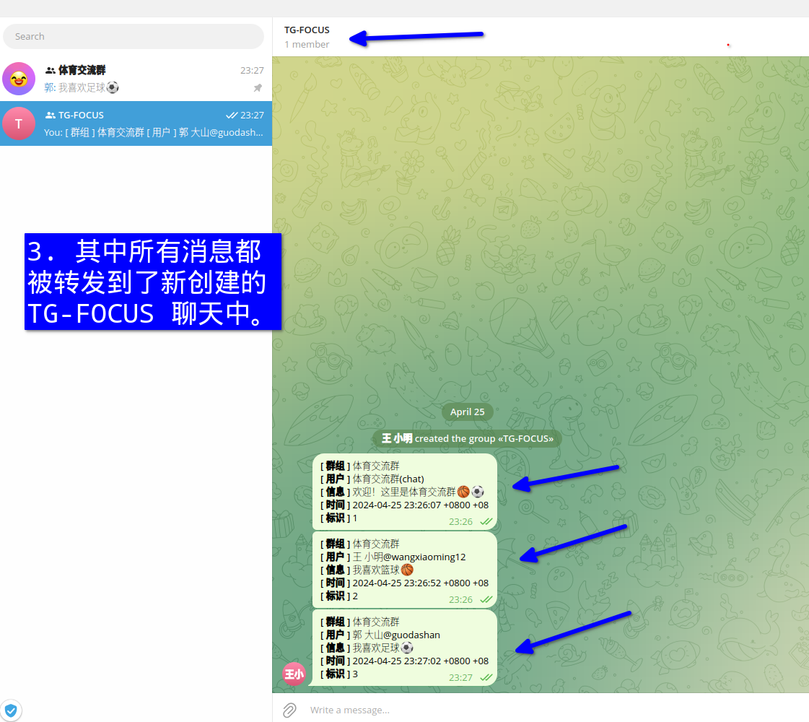
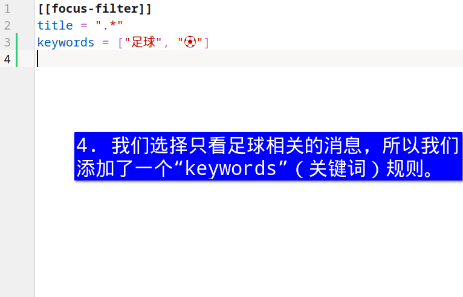
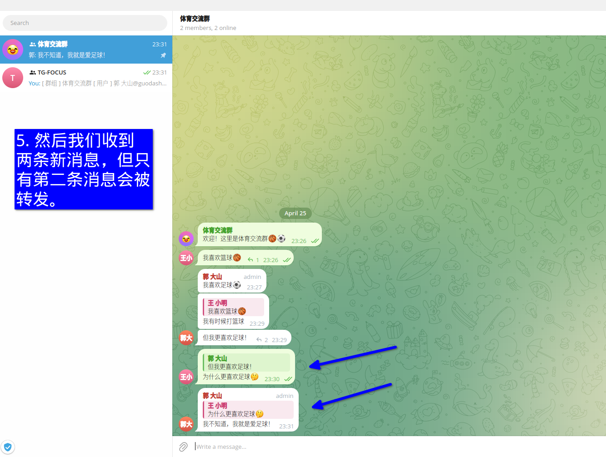
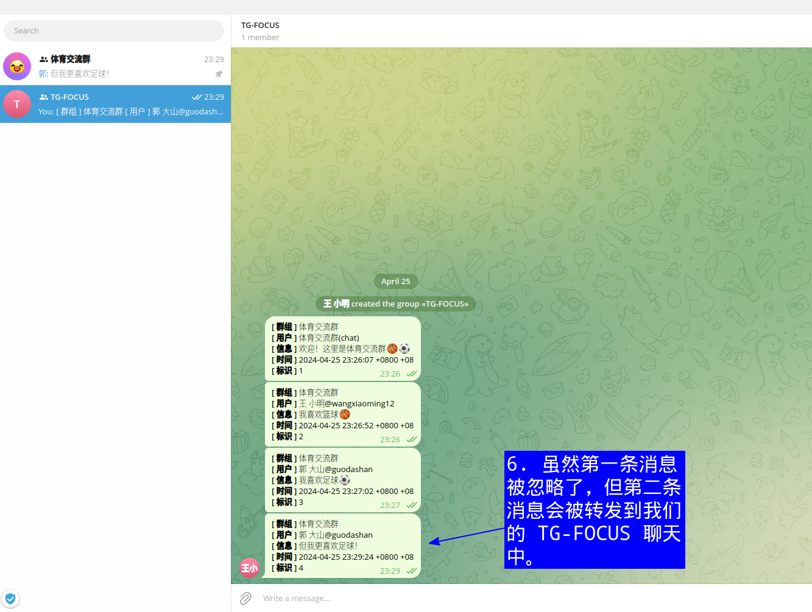
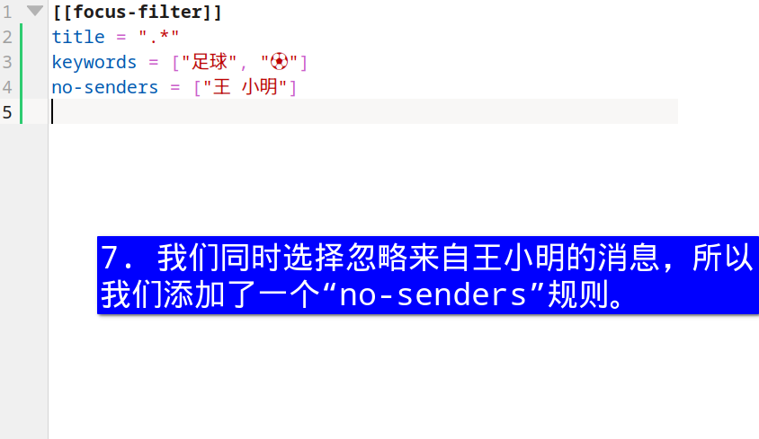
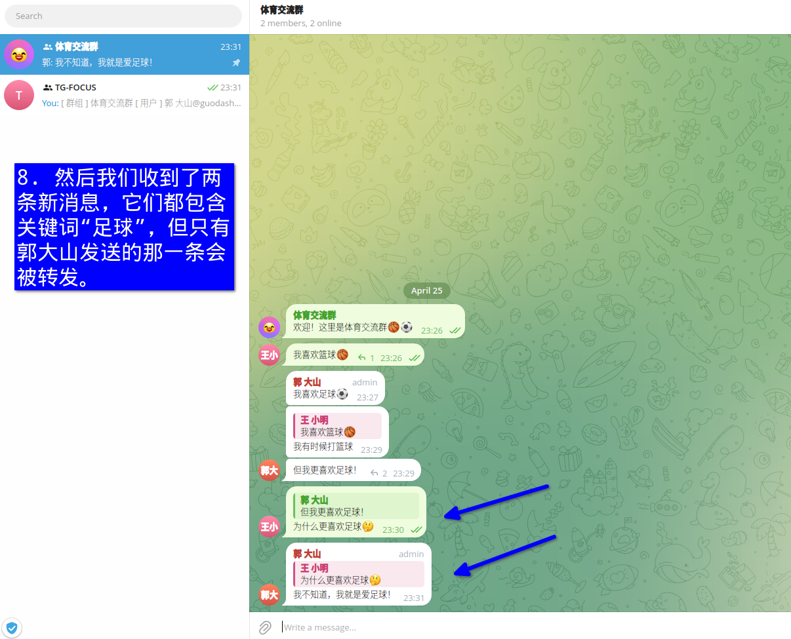
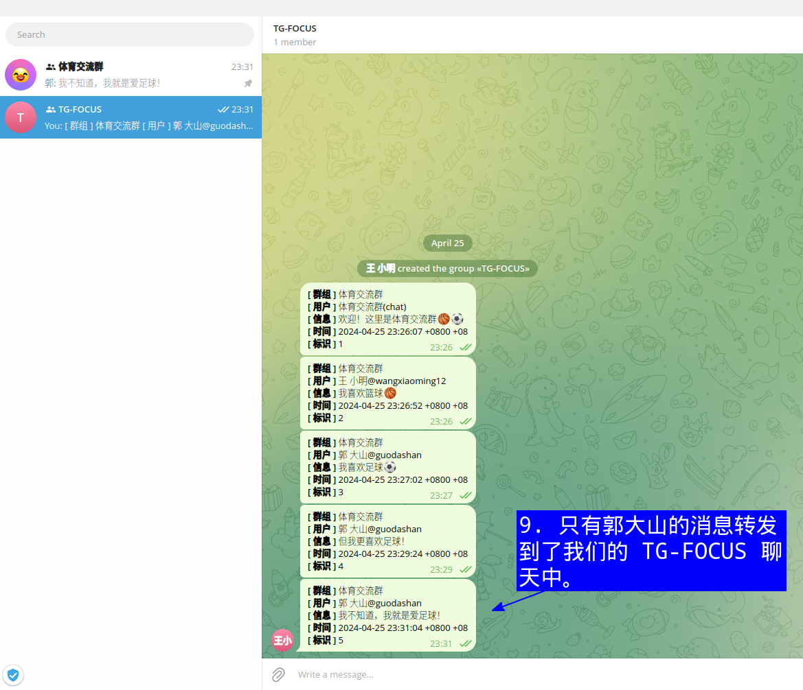

# TG-Focus


# 目录

- [关于](#关于)
- [一个简单的演示](#一个简单的演示)
- [支持的平台](#支持的平台)
- [支持的语言](#支持的语言)
- [如何使用](#如何使用)
  - [硬件要求](#硬件要求)
  - [部署](#部署)
    - [使用预编译二进制文件](#使用预编译二进制文件)
    - [使用 Docker 镜像](#使用-docker-镜像)
- [过滤规则](#过滤规则)
  - [过滤器示例](#过滤器示例)
- [Q\&A](#qa)
  - [我能相信 tg-focus 吗？](#我能相信-tg-focus-吗)
  - [什么使得 tg-focus 成为一个温和的 User Bot？](#什么使得-tg-focus-成为一个温和的-user-bot)
- [开发](#开发)
- [贡献](#贡献)
- [许可证](#许可证)
  


# 关于

tg-focus 是一个全面的帮助您集中注意力的 **T**ele**g**ram 消息过滤器。一个用于消息转发的温和的 User Bot。

它支持多种形式的文本消息：

1. 聊天消息（原始/回复/转发/引用）
2. 媒体标题
3. Emoji 表情符号
4. 频道更新

通过定制 *Focus 过滤器*，tg-focus 可以将任何特定的消息从任何聊天转发到一个名为 *TG-FOCUS*  的专用聊天中，这样用户就可以完全控制他们看到的消息。

Telegram 以其开放性而闻名。虽然用户可以在任何公共聊天室中自由发言，但他们同样应该有权选择他们想看到的内容。Telegram 的官方客户端已经很好地支持了前者，tg-focus 和其他类似工具则试图填补后者的空白。

显著特点：

-   **可靠性和一致性**：tg-focus 直接构建在官方 C++ 接口（[TDLib](https://core.telegram.org/tdlib/)）之上。所有与 Telegram 服务器的通信完全由 TDLib 处理。

-   **易于定制**：用户可以随时自定义 *Focus Filter* 。该过滤器接受简单文本和 [正则表达式](https://en.wikipedia.org/wiki/Regular_expression) 。配置文件采用人类可读的 [TOML](https://toml.io/en/) 格式。

-   **随时部署**：tg-focus 以三种形式发布：源代码、Docker 镜像和预编译的二进制文件。

# 一个简单的演示

以下是一个常见用例的简单 9 步演示：转发包含我们想要的关键词的消息，忽略来自我们不想要的用户发送的消息。







[回到开始](#一个简单的演示)



[回到开始](#一个简单的演示)



[回到开始](#一个简单的演示)



[回到开始](#一个简单的演示)



[回到开始](#一个简单的演示)



[回到开始](#一个简单的演示)



[回到开始](#一个简单的演示)


# 支持的平台

| 操作系统    | 是否支持(x86_64) |
|---------------------|-----------------|
| Windows             | ❌              |
| Windows with WSL 1  | ✅              |
| Windows with WSL 2  | ✅              |
|                     |                 |
| AlmaLinux 9         | ✅              |
| AlmaLinux 8         | ✅              |
| Amazon Linux 2023   | ✅              |
| Amazon Linux 2      | ❌              |
| Amazon Linux 1      | ❌              |
| Arch Linux          | ✅              |
| Debian 12           | ✅              |
| Debian 11           | ✅              |
| Debian 10           | ✅              |
| Fedora 39           | ✅              |
| Fedora 38           | ✅              |
| Fedora 37           | ✅              |
| openSUSE Leap 15.5  | ✅              |
| openSUSE Leap 15.4  | ✅              |
| openSUSE Tumbleweed | ✅              |
| Oracle Linux 9      | ✅              |
| Oracle Linux 8      | ✅              |
| Oracle Linux 7      | ❌              |
| Rocky Linux 9       | ✅              |
| Rocky Linux 8       | ✅              |
| Slackware 15.0      | ✅              |
| Slackware 14.2      | ❌              |
| Solus               | ✅              |
| Ubuntu 23.10        | ✅              |
| Ubuntu 23.04        | ✅              |
| Ubuntu 22.04        | ✅              |
| Ubuntu 20.04        | ✅              |
| Void Linux          | ✅              |
|                     |                 |

**注意**：这不是一个详尽的列表，您可以通过发起 issue 或 pull request 来添加缺失的平台。


# 支持的语言

| 语言                 | 状态                                    |
|--------------------------|-------------------------------------------|
| 英文（香港）     | ✅                                        |
| 英文（美国）  | ✅                                        |
| 英文（津巴布韦）       | ✅                                        |
| 中文（大陆） | ✅                                        |
| 中文（香港） | ✅                                        |
| 其他                   | [添加您的语言](#支持的语言) |
|                          |                                           |

**注意**：可支持更多语言！请根据国际化指示文档（ `docs/i18n.org` ）来添加您的语言。

# 如何使用

在您做任何事情之前，请确保您有：

1. 一个 Telegram 账号
2. 一个 Telegram API ID 和 the 相应的 API HASH，可从 https://my.telegram.org 获取。 

## 硬件要求

硬件上没有严格的限制，这里是 7 天内的内存使用情况概览：

| 第 1 天 | 第 2 天 | 第 3 天 | 第 4 天 | 第 5 天  | 第 6 天  | 第 7 天  |
|------|------|------|------|-------|-------|-------|
| 76MB | 84MB | 90MB | 96MB | 103MB | 108MB | 115MB |

（注意：此表仅供参考，它是由一个拥有约 30 个公共聊天室的账号记录的，其中大多数聊天室都有超过 1000 名成员，并且每天产生 500 条消息）


## 部署

有两种不同的部署方式：

### 使用预编译二进制文件

**步骤 1：**

请在 [GitHub 发布页面](https://github.com/micl2e2/tg-focus/releases) 下载二进制文件。请检查您的平台是否受支持。支持的平台列表请参见 [支持的平台](#支持的平台) 部分。

**步骤 2：**

请先登录您的 Telegram 帐户，需要 API ID、API HASH、您的电话号码（国际格式，不能包含空格，例如：如果您的国家代码是 `+1` 且电话号码是 `234567` ，则输入 `+1234567` ），以及一个登陆验证码。前两者可以在 https://my.telegram.org 中获取。

```sh
/path/to/tgf-conf auth
```

如果您成功登录，控制台最后输出的三行将是：

```
[tgf INFO] Log in successfully!
[tgf INFO] Closing...
[tgf INFO] Closed
```

**步骤 3：（可选）**

 使用默认语言（英语）以外的其他语言：

```sh
/path/to/tgf-conf lang XX-YY
```

注意：XX 为语言代码，YY 为地区代码，例如：“en-US”代表
“英语（美国）”、“en-GB”代表“英语（英国）”等。
所有有效代码均可在以下位置找到：

http://www.lingoes.net/en/translator/langcode.htm 

**步骤 4：**

启动 tg-focus 守护进程：

```sh
# 在前台运行
/path/to/tgf-focusd

# 或在后台运行
nohup /path/to/tgf-focusd &
```

**步骤 5：**

如果您成功登录，tg-focus 将会创建一个名为 `TG-FOCUS` 的新聊天室，随后的消息将被过滤并转发到该聊天室中。

**步骤 6：**

请注意，默认情况下，tg-focus 将转发您收到的**所有**消息。您可以随时更改 *Focus 过滤器*（过滤器配置），以定制您想要在该聊天中接收的消息。请参阅 [示例](#过滤器示例)。

```sh
/path/to/tgf-conf filters
```

（注意：该操作将会打开 [GNU nano](https://www.nano-editor.org/) 编辑器进行配置修改。修改完成后，按 **Ctrl-O**、**Enter**、**Ctrl-X** 保存。只要配置有效，控制台输出的最后一行应为“Saving filters...”）

**步骤 7：**

完成。


### 使用 Docker 镜像

请确保您的计算机上已安装 [Docker](https://docs.docker.com/engine/) 或 [Podman](https://podman.io/) 。

**步骤 1：**

拉取镜像并在后台运行，假设新创建的容器名称为 CONTAINER-NAME：

```sh
docker pull docker.io/micl2e2/tg-focus:latest
docker run -d docker.io/micl2e2/tg-focus
```

**步骤 2：**

请先登录您的 Telegram 帐户，需要 API ID、API HASH、您的电话号码（国际格式，不能包含空格，例如：如果您的国家代码是 `+1` 且电话号码是 `234567` ，则输入 `+1234567` ），以及一个登陆验证码。前两者可以在 https://my.telegram.org 中获取。

```sh
docker exec -it CONTAINER-NAME tgf-conf auth
```

如果您成功登录，控制台最后输出的三行将是：

```
[tgf INFO] Log in successfully!
[tgf INFO] Closing...
[tgf INFO] Closed
```

**步骤 3：（可选）**

 使用默认语言（英语）以外的其他语言：

```sh
docker exec -it CONTAINER-NAME tgf-conf lang XX-YY
```

注意：XX 为语言代码，YY 为地区代码，例如：“en-US”代表
“英语（美国）”、“en-GB”代表“英语（英国）”等。
所有有效代码均可在以下位置找到：

http://www.lingoes.net/en/translator/langcode.htm 

**步骤 4：**

如果您成功登录，tg-focus 将会创建一个名为 `TG-FOCUS` 的新聊天室，随后的消息将被过滤并转发到该聊天室中。

**步骤 5：**

请注意，默认情况下，tg-focus 将转发您收到的**所有**消息。您可以随时更改 *Focus 过滤器*（过滤器配置），以定制您想要在该聊天中接收的消息。请参阅 [示例](#过滤器示例)。

```sh
docker exec -it CONTAINER-NAME tgf-conf filters
```

（注意：该操作将会打开 [GNU nano](https://www.nano-editor.org/) 编辑器进行配置修改。修改完成后，按 **Ctrl-O**、**Enter**、**Ctrl-X** 保存。只要配置有效，控制台输出的最后一行应为“Saving filters...”）

**步骤 6：**

完成。

**步骤 7：（可选）**

如果您要销毁容器实例及其与 Telegram 相关的凭据和资源，请使用以下命令：

```sh
docker rm --force CONTAINER-NAME
```


# 过滤规则

A *Focus Filter* is a filter used by tg-focus to match against the
message's text content(text, emoji, or media caption). They are:
- `title`
- `keywords`
- `no-keywords`
- `senders`
- `no-senders`
- `rej-senders`

Users can add as many filters as they like, they accept **simple
text** or **regular expression**. 

When a message comes, they are tried one by one, if there is any
filter than can *match* the message and not *skip* the message , it
will be forwarded.

Currently *Focus Filter* can *match*:

- Chat title(`title`)
- Keywords(`keywords`)
- Senders(`senders`)

can *skip*:

- Keywords(`no-keywords`)
- Senders(`no-senders`)

can *reject*:

- Senders(`rej-senders`)

A message is forwarded **if and only if**:

- it is *matched* by a *Focus Filter*, **and**
- it is *not skipped* by that *Focus Filter*, **and**
- it is *not rejected* by any previous *Focus Filter*.

(Note that the first three rules can be regarded as **whitelist**,
the second two rules can be regarded as **weak blacklist**, the third
one can be regarded as **strong blacklist**) 


## 过滤器示例

Say we want to forward all messages in a chat named
"👍AnAwesomeChat👍": 

works, the chat title is fully matched: 

```toml
[[focus-filter]]
title = "👍AnAwesomeChat👍"
```

works, the chat title is partly matched:

```toml
[[focus-filter]]
title = "AnAwesomeChat"
```

works, the chat title is partly matched: 

```toml
[[focus-filter]]
title = "Awesome"
```

works, the chat title is partly matched:

```toml
[[focus-filter]]
title = "👍"
```

works, the regular expression matches the chat title:

```toml
[[focus-filter]]
title = ".*Awesome.*"
```

Say we want to forward the messages that contain "football", but not
"basketball", from a chat named "Sports User Group". We can write our filters as

```toml
[[focus-filter]]
title = "Sports User Group"
keywords = ["football", "soccer"]
no-keywords = ["basketball"]
```

Say we want the messages containing "football", or any other
messages except the ones containing "basketball", and the ones sent by
the user whose full name is "Basketball Lover", or the ones sent by the
user whose user ID is "alice_love_basketball", from a chat named
"SportsUserGroup". We can write the filter as:

```toml
# 1st
[[focus-filter]]
title = "Sports User Group"
keywords = ["football", "soccer"]

# 2nd
[[focus-filter]]
title = "Sports User Group"
no-keywords = ["basketball"]
no-senders = ["Basketball Love", "@alice_love_basketball"]
```

So these message will be forwarded:

- `Alice: I love football!` (matching the 1st)
- `Bob: I play soccer.` (matching the 1st)
- `Alice: I am good at swimming.` (matching the 2nd)
- `Bob: Sometime I also play badminton.` (matching the 2nd)
- `Alice: I play football and basketball.` (matching the 1st, skip the 2nd)

these will NOT be forwarded:

- `Alice: I play badminton and basketball.` (matching the 2nd's
  "no-keywords" means a *reject*)
- `Basketball Lover: Hellop everyone!` (a *reject* by the 2nd)
- `Alice @alice_love_basketball: Hi, I am Alice, I love sports.`
  (a *reject* by the 2nd)


# Q&A

## 我能相信 tg-focus 吗？

Absolutely yes!

First of all, consider that tg-focus is a GPL-licensed [free
software](https://www.gnu.org/philosophy/free-sw.en.html). 

tg-focus inherits the openness of TDLib, its source as well as its 
dependencies' source are completely open. Additionally, all its
binaries and OCI images will **not** be built by any individual, but
by Github-hosted machines. All build details can be found in a
dedicated repository
[tg-focus-cicd](https://github.com/micl2e2/tg-focus-cicd). 

Telegram bot is useful for some specific tasks, but not sufficient
to be a **comprehensive** message filter. Therefore, during the
authorization process, tg-focus needs to log in user's account,
which in turn needs a phone number and login code,
just as any functional Telegram client would require. It only saves
API ID/HASH on the user's machine because these two are
required each time client initialization. But **under no
circumstances** would tg-focus save user's phone number or any
other credentials.


## 什么使得 tg-focus 成为一个温和的 User Bot？

TDLib states that it is _a library for building Telegram
clients_. By embedding TDLib, tg-focus, like any other User
Bot, is able to use all TDLib's public APIs. While it opens the
possibility for many powerful features, it also means User Bots have
far more privileges than a general-purpose
[Bot](https://core.telegram.org/bots). This can be a double-edged
sword.

There are already some examples where some of the good-purpose User
Bots disappoint their users because of their misuse of Telegram APIs,
such as repeatedly sending random messages to users' random
chats, or other unmanaged behaviors. This is probably one of
the reasons why Telegram User Bots have a bad reputation. 

However, tg-focus will not follow their paths, we have one strict
principle: **all message collected by tg-focus will only be forwarded
to a newly created chat**. 

With this principle, it is firmly guaranteed that **no** messages
generated by tg-focus will be ever sent to the wrong chat. Additionally,
there is **no** reason for tg-focus users to worry about whether any
existing or new features will be harmful or not. By the time of
updates, tg-focus will remain **gentle**.

# 开发

See `docs/development.org`.

# 贡献

tg-focus is still far from perfect, any form of contribution is
welcomed! 

- Ask question (open an issue with label [](https://github.com/micl2e2/tg-focus/issues/new))
- Bug Report (open an issue with label [](https://github.com/micl2e2/tg-focus/issues/new))
- Feature Request (open an issue with label
  [](https://github.com/micl2e2/tg-focus/issues/new))
- Documentation Improvement
- Code Contribution (tg-focus follows [GCC](https://gcc.gnu.org/) code style)


# 许可证

tg-focus is licensed under [GNU General Public License Version
3.0](https://github.com/micl2e2/tg-focus/blob/master/LICENSE-GPL). 

